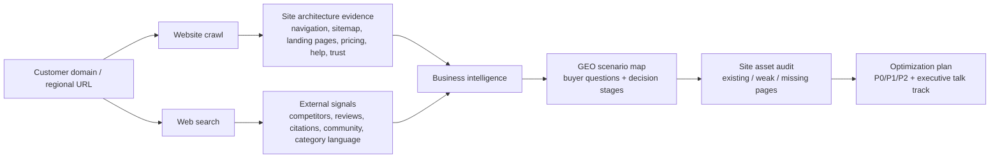

<!-- DAGENO_AGENT_NAV_START -->

**Dageno Agent Project Map / Dageno Agent 项目导航**

Docs / 文档: [README](https://github.com/dageno-agents/geo-site-architecture-audit) · [简体中文](https://github.com/dageno-agents/geo-site-architecture-audit/blob/main/README.zh-CN.md)

If this repo is useful, you may also want the adjacent Dageno Agent projects for GEO, SEO, AI visibility, and content operations.
如果这个仓库对你有帮助，也可以看看这些相邻的 Dageno Agent 项目，用于 GEO、SEO、AI 可见性和内容增长工作流。

| If you want to... / 如果你想... | Project / 项目 | Plain-language difference / 白话区别 |
| --- | --- | --- |
| First diagnose a site / 先给网站做体检 | [seo-geo-audit](https://github.com/dageno-agents/seo-geo-audit) | Like an SEO + GEO medical report: technical issues, content gaps, trust signals, off-site mentions, and AI visibility in one audit / 像一份 SEO + GEO 体检报告，把技术问题、内容缺口、信任信号、站外提及和 AI 可见性放到一起看 |
| Turn a real website into Dageno topics and prompts / 把真实网站变成 Dageno 监控题库 | [dageno-online-topic-prompt-generator](https://github.com/dageno-agents/dageno-online-topic-prompt-generator) | Crawls the site and studies the business first, then generates Topic clusters and high-intent Prompts. Not an industry-template prompt dump / 先看网站和业务，再生成 Topic 集群和高意图 Prompt，不是套行业模板 |
| Produce SEO/GEO articles from keywords or briefs / 从关键词或 brief 批量生产内容 | [seo-geo-content-engine](https://github.com/dageno-agents/seo-geo-content-engine) | A full content pipeline: research, SERP intent, article structure, draft, metadata, FAQ, and GEO packaging / 完整内容流水线：调研、搜索意图、文章结构、正文、metadata、FAQ 和 GEO 包装 |
| Write from Dageno fanout data / 用 Dageno fanout 写文章 | [geo-content-writer](https://github.com/dageno-agents/geo-content-writer) | For when Dageno already found prompt opportunities: turn fanout into a backlog, editorial brief, draft contract, and review contract / 适合已经有 Dageno prompt opportunity 的情况：把 fanout 变成选题队列、编辑 brief、草稿契约和审核契约 |
| Find why organic content is not converting / 找出自然流量内容为什么不转化 | [organic-content-intelligence](https://github.com/dageno-agents/organic-content-intelligence) | Joins GSC, GA4, crawl, intent, and AI/GEO signals to show which pages have demand but fail to answer or convert / 把 GSC、GA4、抓取、意图和 AI/GEO 信号连起来，看哪些页面有需求但没有承接住 |
| Improve a site's GEO structure / 优化网站结构以适配 GEO | [geo-site-architecture-audit](https://github.com/dageno-agents/geo-site-architecture-audit) | Starts from the existing navigation, sitemap, landing pages, and help content, then finds missing AI-answerable pages and internal links / 从现有导航、站点地图、落地页和帮助内容出发，找缺失的 AI 可引用页面和内链结构 |
| Create a client-facing AI visibility report / 做给客户看的 AI 可见性报告 | [brand-ai-performance-check](https://github.com/dageno-agents/brand-ai-performance-check) | A stable visual report template for brand AI performance, using Dageno API data or custom inputs / 稳定的品牌 AI 表现可视化报告模板，可接 Dageno API 或自定义数据 |
| Automate Dageno in workflows / 把 Dageno 接进自动化流程 | [n8n-nodes-dageno](https://github.com/dageno-agents/n8n-nodes-dageno) | Use Dageno inside n8n: brands, GEO analysis, keywords, opportunities, topics, prompts, SEO, and citations / 在 n8n 里调用 Dageno：品牌、GEO 分析、关键词、机会、Topic、Prompt、SEO 和引用数据 |
| Learn the API and MCP growth workflow / 学 Dageno API 和 MCP 怎么用于增长 | [dageno-mcp-growth-playbook](https://github.com/dageno-agents/dageno-mcp-growth-playbook) | The practical playbook for turning Dageno API/MCP data into reports, prompt gaps, citation intelligence, and growth actions / 把 Dageno API/MCP 数据变成报告、Prompt Gap、引用分析和增长动作的实战手册 |

More projects / 更多项目: [geo-visual-content-engine](https://github.com/dageno-agents/geo-visual-content-engine), [seo-outreach-skill](https://github.com/dageno-agents/seo-outreach-skill), [geo-pre-sale-report-private](https://github.com/dageno-agents/geo-pre-sale-report-private), [GEO-SEO](https://github.com/dageno-agents/GEO-SEO).

Explore all repos / 查看全部项目: [github.com/dageno-agents](https://github.com/dageno-agents) · Product / 产品: [Dageno](https://dageno.ai/?utm_source=github&utm_medium=social&utm_campaign=official)

<!-- DAGENO_AGENT_NAV_END -->

# GEO Site Architecture Audit

> Audit a real customer website, understand its business from crawl and search evidence, then turn its existing site architecture into GEO-ready content and internal-structure recommendations.

Most GEO proposals start with generic content ideas.

This one starts from the customer's actual website.

It crawls the homepage, navigation, sitemap, core landing pages, pricing/account pages, help center, blog/academy, trust/legal pages, and external search signals. Then it maps what already exists into AI-answerable buyer scenarios and identifies what is missing, fragmented, or not yet structured enough for generative search engines to quote and recommend.

The goal is not to tell mature SEO teams to "publish more content."

The goal is to answer:

- what the business actually sells
- which pages already support buyer decisions
- which pages can become AI-citable evidence assets
- which decision questions are not answered clearly enough
- how site architecture should be enriched for GEO
- what to say to executives without drowning them in implementation detail

## Why This Exists

Many established companies already have strong SEO foundations: rich navigation, product pages, pricing pages, help centers, blogs, academy content, legal pages, and conversion flows.

For these customers, generic GEO content distribution advice sounds shallow.

This Skill is designed to prevent that failure mode.

It asks a harder question:

**How should the customer's existing site architecture be reorganized, clarified, and enriched so AI systems can confidently cite it, compare it, and recommend the brand in buyer-decision answers?**

## How It Works



The pipeline has seven gates:

1. **Normalize** the target domain, region, language, and crawl boundaries.
2. **Crawl** homepage, navigation, sitemap, and high-value page types.
3. **Search** for business, competitor, review, pricing, trust, and community context.
4. **Infer** the real business model, conversion path, buyer personas, and decision criteria.
5. **Map** site assets to GEO scenarios such as selection, pricing, trust, comparison, risk, and conversion.
6. **Diagnose** whether content is missing, fragmented, not structured, not localized, or not citation-ready.
7. **Output** a concise executive talk track plus a structured site optimization roadmap.

This project is intentionally narrower than [`seo-geo-audit`](https://github.com/dageno-agents/seo-geo-audit). Use `seo-geo-audit` for a broad SEO + GEO health check. Use this project when the broad audit or user context shows that the site already has a meaningful SEO foundation and the real question is how to reorganize existing pages into buyer-decision evidence assets.

## What It Produces

### Business Profile

The audit starts by describing the business in plain language.

Example fields:

| Field | Meaning |
|---|---|
| `brand` | Canonical brand and aliases |
| `category` | Plain-English business category |
| `business_model` | How the company sells or converts |
| `users` | Buyers, users, operators, or decision makers |
| `conversion_path` | Purchase, signup, demo, quote, account opening, app install, etc. |
| `decision_criteria` | Pricing, trust, performance, safety, compatibility, support, proof |
| `competitors` | Direct, indirect, and source competitors |
| `confidence` | Confidence level based on crawl/search evidence |

### Site Architecture Map

Each major site area is mapped to business and GEO purpose.

| Site Area | Examples | GEO Role |
|---|---|---|
| Product / service pages | products, markets, features, solutions | Answer "what can I use this for?" |
| Pricing / plans / account pages | pricing, fees, plans, accounts | Answer "what does it cost and which plan fits?" |
| Trust / legal / proof pages | about, safety, compliance, reviews, cases | Answer "is this reliable?" |
| Tool / platform pages | apps, integrations, docs, downloads | Answer "how do I use or integrate it?" |
| Education / resources | blog, academy, guides, webinars | Answer early-stage research questions |
| Support / help center | FAQ, docs, contact, complaints | Answer objection and post-click questions |

### GEO Site Optimization Plan

The default output is executive-friendly:

| Priority | Meaning |
|---|---|
| `P0` | Pages that directly affect AI trust, recommendation, pricing, or conversion |
| `P1` | Product, scenario, and platform pages that expand recommendation coverage |
| `P2` | Education, news, glossary, and resource pages that support early discovery |

Each material recommendation should be evidence-bound:

| Field | Meaning |
|---|---|
| `priority` | P0 / P1 / P2 |
| `buyer_question` | The user or AI question the recommendation answers |
| `existing_evidence` | URLs and observed facts supporting the diagnosis |
| `gap_type` | missing, fragmented, weakly_structured, unlocalized, or not_citation_ready |
| `recommended_page_or_module` | The page, module, FAQ, internal-link, or schema change |
| `business_impact` | Why this matters for conversion, trust, or recommendation coverage |
| `confidence` | high / medium / low based on crawl and search evidence |

## Why Site Architecture Matters For GEO

AI systems rarely recommend a brand because one page says "we are the best."

They need a chain of evidence:

```text
category page
  + pricing / account / plan page
  + comparison page
  + trust / safety / compliance page
  + help center / FAQ
  + third-party or community signals
```

This Skill audits whether the website has that chain, and whether it is explicit enough for AI answers.

## Output Example

```markdown
# Example Brand — GEO Site Architecture Audit

## 1. Executive Read

This customer does not lack SEO content. It already has strong product, pricing, support, and resource pages.

The GEO issue is that these assets are not yet organized into AI-citable decision evidence.

## 2. Business Understanding

The core conversion path is trial signup -> product evaluation -> paid plan.
The main buyer questions are pricing, integration fit, reliability, migration risk, and alternatives.

## 3. Current Site Architecture

| Site Area | Existing Assets | GEO Diagnosis |
|---|---|---|
| Pricing | Pricing page exists | Needs use-case and plan-selection FAQ |
| Integrations | Many pages exist | Needs comparison and implementation decision pages |
| Trust | Security page exists | Needs consolidated Trust Center |

## 4. P0 Recommendations

1. Create a plan comparison page for buyer scenarios.
2. Add total cost and ROI explanations to pricing.
3. Build a Trust Center that links security, compliance, uptime, support, and customer proof.
```

## Repository Structure

```text
geo-site-architecture-audit/
  README.md
  SKILL.md
  agents/
    openai.yaml
  references/
    crawl-checklist.md
    crawl-presets.md
    evidence-schema.md
    recommendation-schema.md
    scoring-rubric.md
    search-context-queries.md
    geo-page-patterns.md
    output-templates.md
    regulated-industries.md
    industry-playbooks/
      b2b-saas.md
      finance-trading.md
      ecommerce.md
      local-services.md
  examples/
    mature-saas.expected.md
    regulated-finance.expected.md
    multi-region-site.expected.md
  evals/
    trigger-prompts.md
    non-trigger-prompts.md
    output-quality-checklist.md
  docs/
    agent-guide.md
    measurement.md
    security.md
```

## For Humans And Agents

If you are reviewing the Skill:

- Start with this README.
- Read [Agent Guide](docs/agent-guide.md) to understand the exact execution sequence.
- Read [Security](docs/security.md) before adding crawlers, customer exports, API keys, or hosted runtimes.

If you are an AI coding agent:

- Load `SKILL.md` first.
- Load `references/crawl-checklist.md` before crawling or auditing a website.
- Load `references/crawl-presets.md` to choose a page cap and scope.
- Load `references/evidence-schema.md` and `references/recommendation-schema.md` before drafting recommendations.
- Load `references/scoring-rubric.md` when assigning P0/P1/P2 priority.
- Load `references/search-context-queries.md` when planning external search and query fan-out checks.
- Load `references/geo-page-patterns.md` when mapping pages to GEO assets.
- Load `references/output-templates.md` before writing executive or implementation outputs.
- Load `references/regulated-industries.md` for financial, medical, legal, insurance, investment, or other high-trust categories.
- Load an industry playbook from `references/industry-playbooks/` when the target business clearly matches one.
- Never produce generic content-distribution advice before inspecting the customer's actual site architecture.

## Open-Core Boundary

Good to keep in this public repository:

- Skill workflow
- Crawl and audit checklist
- GEO page-type patterns
- Output templates
- Safety and fallback policy

Keep private:

- API keys
- customer crawl data
- customer Dageno exports
- proprietary scoring weights
- unpublished customer examples
- raw internal sales notes
- credentials, cookies, or logged-in screenshots

## License

MIT
