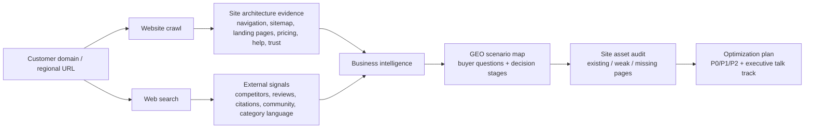

# GEO Site Architecture Audit

> Audit a real customer website, understand its business from crawl and search evidence, then turn its existing site architecture into GEO-ready content and internal-structure recommendations.

Most GEO proposals start with generic content ideas.

This one starts from the customer's actual website.

It crawls the homepage, navigation, sitemap, core landing pages, pricing/account pages, help center, blog/academy, trust/legal pages, and external search signals. Then it maps what already exists into AI-answerable buyer scenarios and identifies what is missing, fragmented, or not yet structured enough for generative search engines to quote and recommend.

The goal is not to tell mature SEO teams to "publish more content."

The goal is to answer:

- what the business actually sells
- which pages already support buyer decisions
- which pages can become AI-citable evidence assets
- which decision questions are not answered clearly enough
- how site architecture should be enriched for GEO
- what to say to executives without drowning them in implementation detail

## Why This Exists

Many established companies already have strong SEO foundations: rich navigation, product pages, pricing pages, help centers, blogs, academy content, legal pages, and conversion flows.

For these customers, generic GEO content distribution advice sounds shallow.

This Skill is designed to prevent that failure mode.

It asks a harder question:

**How should the customer's existing site architecture be reorganized, clarified, and enriched so AI systems can confidently cite it, compare it, and recommend the brand in buyer-decision answers?**

## How It Works



The pipeline has seven gates:

1. **Normalize** the target domain, region, language, and crawl boundaries.
2. **Crawl** homepage, navigation, sitemap, and high-value page types.
3. **Search** for business, competitor, review, pricing, trust, and community context.
4. **Infer** the real business model, conversion path, buyer personas, and decision criteria.
5. **Map** site assets to GEO scenarios such as selection, pricing, trust, comparison, risk, and conversion.
6. **Diagnose** whether content is missing, fragmented, not structured, not localized, or not citation-ready.
7. **Output** a concise executive talk track plus a structured site optimization roadmap.

## What It Produces

### Business Profile

The audit starts by describing the business in plain language.

Example fields:

| Field | Meaning |
|---|---|
| `brand` | Canonical brand and aliases |
| `category` | Plain-English business category |
| `business_model` | How the company sells or converts |
| `users` | Buyers, users, operators, or decision makers |
| `conversion_path` | Purchase, signup, demo, quote, account opening, app install, etc. |
| `decision_criteria` | Pricing, trust, performance, safety, compatibility, support, proof |
| `competitors` | Direct, indirect, and source competitors |
| `confidence` | Confidence level based on crawl/search evidence |

### Site Architecture Map

Each major site area is mapped to business and GEO purpose.

| Site Area | Examples | GEO Role |
|---|---|---|
| Product / service pages | products, markets, features, solutions | Answer "what can I use this for?" |
| Pricing / plans / account pages | pricing, fees, plans, accounts | Answer "what does it cost and which plan fits?" |
| Trust / legal / proof pages | about, safety, compliance, reviews, cases | Answer "is this reliable?" |
| Tool / platform pages | apps, integrations, docs, downloads | Answer "how do I use or integrate it?" |
| Education / resources | blog, academy, guides, webinars | Answer early-stage research questions |
| Support / help center | FAQ, docs, contact, complaints | Answer objection and post-click questions |

### GEO Site Optimization Plan

The default output is executive-friendly:

| Priority | Meaning |
|---|---|
| `P0` | Pages that directly affect AI trust, recommendation, pricing, or conversion |
| `P1` | Product, scenario, and platform pages that expand recommendation coverage |
| `P2` | Education, news, glossary, and resource pages that support early discovery |

## Why Site Architecture Matters For GEO

AI systems rarely recommend a brand because one page says "we are the best."

They need a chain of evidence:

```text
category page
  + pricing / account / plan page
  + comparison page
  + trust / safety / compliance page
  + help center / FAQ
  + third-party or community signals
```

This Skill audits whether the website has that chain, and whether it is explicit enough for AI answers.

## Output Example

```markdown
# Example Brand — GEO Site Architecture Audit

## 1. Executive Read

This customer does not lack SEO content. It already has strong product, pricing, support, and resource pages.

The GEO issue is that these assets are not yet organized into AI-citable decision evidence.

## 2. Business Understanding

The core conversion path is trial signup -> product evaluation -> paid plan.
The main buyer questions are pricing, integration fit, reliability, migration risk, and alternatives.

## 3. Current Site Architecture

| Site Area | Existing Assets | GEO Diagnosis |
|---|---|---|
| Pricing | Pricing page exists | Needs use-case and plan-selection FAQ |
| Integrations | Many pages exist | Needs comparison and implementation decision pages |
| Trust | Security page exists | Needs consolidated Trust Center |

## 4. P0 Recommendations

1. Create a plan comparison page for buyer scenarios.
2. Add total cost and ROI explanations to pricing.
3. Build a Trust Center that links security, compliance, uptime, support, and customer proof.
```

## Repository Structure

```text
geo-site-architecture-audit/
  README.md
  SKILL.md
  agents/
    openai.yaml
  references/
    crawl-checklist.md
    geo-page-patterns.md
    output-templates.md
    regulated-industries.md
  docs/
    agent-guide.md
    security.md
```

## For Humans And Agents

If you are reviewing the Skill:

- Start with this README.
- Read [Agent Guide](docs/agent-guide.md) to understand the exact execution sequence.
- Read [Security](docs/security.md) before adding crawlers, customer exports, API keys, or hosted runtimes.

If you are an AI coding agent:

- Load `SKILL.md` first.
- Load `references/crawl-checklist.md` before crawling or auditing a website.
- Load `references/geo-page-patterns.md` when mapping pages to GEO assets.
- Load `references/output-templates.md` before writing executive or implementation outputs.
- Load `references/regulated-industries.md` for financial, medical, legal, insurance, investment, or other high-trust categories.
- Never produce generic content-distribution advice before inspecting the customer's actual site architecture.

## Open-Core Boundary

Good to keep in this public repository:

- Skill workflow
- Crawl and audit checklist
- GEO page-type patterns
- Output templates
- Safety and fallback policy

Keep private:

- API keys
- customer crawl data
- customer Dageno exports
- proprietary scoring weights
- unpublished customer examples
- raw internal sales notes
- credentials, cookies, or logged-in screenshots

## License

MIT
